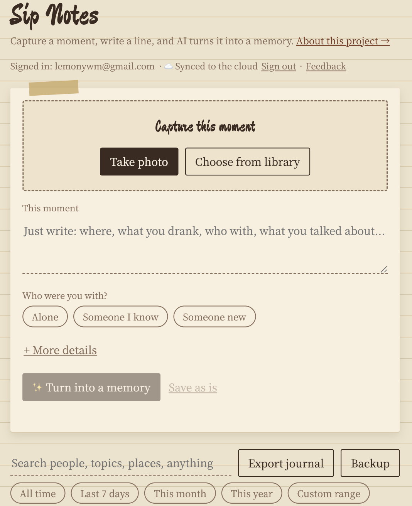
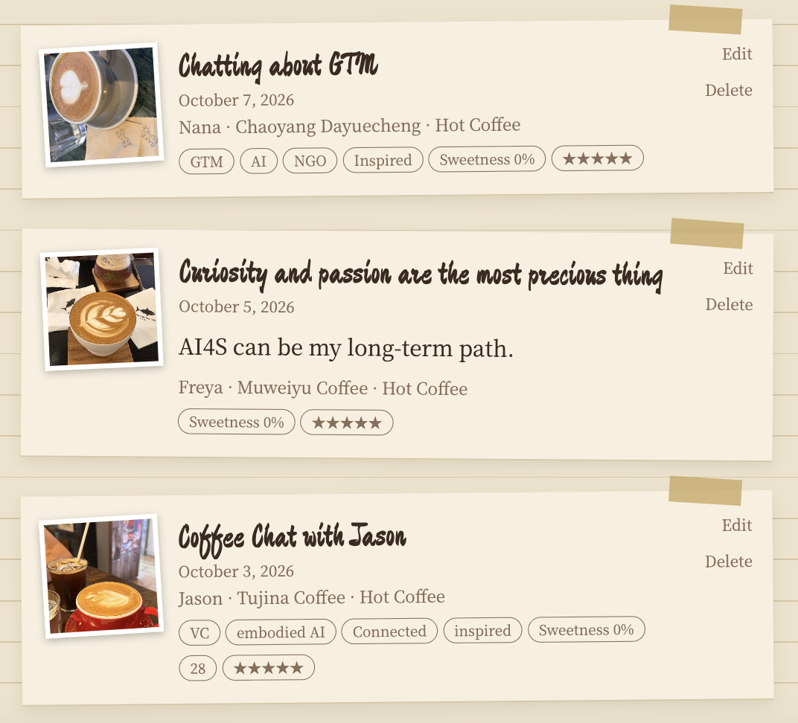
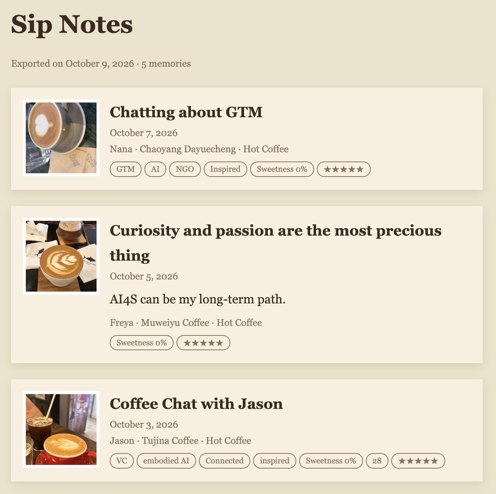

# Sip Notes · 一杯一页

A personal memory layer for real life, built around coffee & tea.
Take a photo, write one sentence, and AI organizes it into a memory you confirm before saving.

围绕咖啡和茶的个人记忆层：拍一张照、写一句话，AI 整理成一条记忆，你确认后才保存。

**Live demo:** https://wonderful-lamington-a990c2.netlify.app  ·  **Case study:** `/about.html` (中文 / English)

  

## Why
Tracking apps usually die for two reasons: logging takes effort, and you get nothing back. What I want to keep from a café visit is not "an americano", it is the moment and the person I met. v1 asked AI to recognize the drink from a photo; it was unreliable and low-value, so I cut it and changed AI's role from *recognizing* to *organizing*.

## Features
- **Photo → one sentence → memory.** Up to 3 photos per memory. Every detail field (drink, temperature, sweetness, price, place, mood, rating) is optional and collapsed.
- **AI organizes, never invents.** Title, short story, people, topics and moods come only from what the user wrote or text clearly legible in a photo. No drink guessing, no invented cafés, prices or people; unsure means blank. Results appear as an editable preview, and user input always overrides AI.
- **People as a first-class field** (alone / someone I know / someone new), filter by person and by time range.
- **Guest-first accounts.** The first memory works without signing up; after saving, the app invites email + password sign-up and syncs local memories to the cloud (edits and deletes included).
- Edit saved memories, export a readable HTML journal or a JSON backup, EN/中文 switch, in-app feedback form.

## Architecture
- Static front end (`index.html`, vanilla JS, no build step) on Netlify.
- `netlify/functions/organize.mjs`: serverless proxy to any OpenAI-compatible LLM. The API key stays server-side; best-effort per-IP rate limit; swap models with env vars.
- Supabase (Postgres + Auth) with row-level security: each user can only read and write their own rows. Feedback is insert-only for everyone.
- Data model: memory entries are JSON (`photos[]`, `place{text,source,lat,lng,placeId}`, `moods[]`, `topics[]`, `updatedAt`); place is an object with a source so GPS / EXIF / OCR / maps can plug in later.

## Run it yourself
1. Create a Supabase project, run `supabase/memories.sql` and `supabase/feedback.sql` in the SQL editor, and turn off "Confirm email" for the email provider.
2. Put your project URL and publishable key in `index.html` (`const SB`). The publishable key is designed to be public; row-level security protects the data.
3. Deploy the folder to Netlify (drag and drop works). Set env vars: `AI_API_KEY` (required); optional `AI_BASE_URL`, `AI_MODEL`, `AI_VISION_MODEL` (defaults target Zhipu's free models; check the console for current names).
4. Redeploy so the variables take effect. Never commit API keys.

## Known limitations
- Email + password without email verification and without password reset (customizing code emails needs a custom SMTP server and domain).
- Photos are stored as small thumbnails inside the database row; fine for personal use, move to object storage at scale.
- Rate limiting is in-memory per function instance, so it is best-effort only.
- No automated test suite or AI evaluation set yet.

## Roadmap
Email-code login and password reset · per-person and per-topic timelines · voice notes · a small evaluation set to measure hallucination rate.
